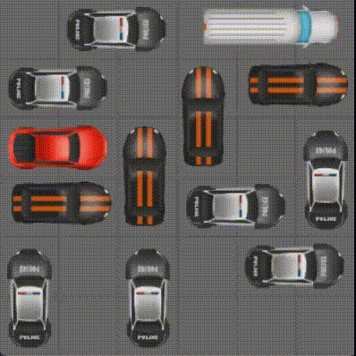
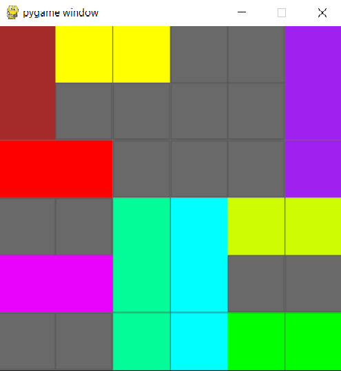

# Rush Hour

This project implements various algorithms and heuristics to solve Rush Hour puzzles.



  

## TODO

  

- In main.py run_algorithms and display_results to Rushhour class if better

- Experiments

- Make sure README and requirements correct

  

## Aan de slag (Getting Started)

  

### Vereisten (Prerequisites)

  

Deze codebase is volledig geschreven in [Python3.9.13](https://www.python.org/downloads/). In requirements.txt staan alle benodigde packages om de code succesvol te draaien. Deze zijn gemakkelijk te installeren via pip dmv. de volgende instructie:

  

```

pip install -r requirements.txt

```

  

### Structuur (Structure)

  

* Alle Python scripts, op main.py na, staan in de folder rushhourcode.

- De gebruikte algoritmes staan in de folder algorithms.

- De classes voor auto, bord en rushhour staan in de folder classes.

- De visualitie staat in de folder visualization.

  

* Alle startborden staan in csv formaat in de map gameboards.

* Het python script om het programma te runnen, main.py, staat in de root directory.

  

### Test (Testing)

  

Om de code te runnen op 1 van de 7 gegeven borden gebruik de instructie:

  

```

python main.py algorithm_number board_number [-v] [-d]

```

De volgende opties zijn er voor algoritmen:
| 0 	| 1 	| 2 	| 3 	| 4 	| 5 	| 6 	| 7 	| 8 	| 9 	|
|:---:	|:---:	|:---:	|:---:	|:---:	|:---:	|:---:	|:---:	|:---:	|:---:	|
| Random 	| Breadth First Search 	| Iterative Deepening 	| Shortened Path Random 	| Beam Search 	| AStar 1 	| AStar 2 	| AStar 3 	| Moves Freed Heuristic 	|  	|

Met de optie -v zul je een visualisatie van de oplossing zien wanneer die gevonden is en met de optie -d kun je tussendoor zien wat de diepte is die het algoritme nu doorzoekt.

  Om de code te runnen op een random gegenereerd bord gebruik de instructie:
```

python main.py algorithm_number -r [-v] [-d]

```

Dus wil je Breadth First Search runnen op bord 2 en na het runnen een visualisatie zien van de oplossing:

  

```

python main.py 1 2 -v

```

  

### Visualisatie

  

De visualisatie is gedaan met behulp van de pygame module. Om de visualisatie te runnen

moet het volgende worden gedaan. Eerst wordt het programma gerund, zoals hierboven

staat vermeld. Hierin worden twee output files gecreëerd: path output en board output. De

laatste output file wordt gebruikt door visualize.py (in de visualization folder) te runnen.

  



  

## Auteurs (Authors)

  

* Anoeya Sivanathan

* Bauke Nieuwenhuis

* Wouter Bant

  

## Dankwoord (Acknowledgments)

  

* Minor Programmeren van de UvA