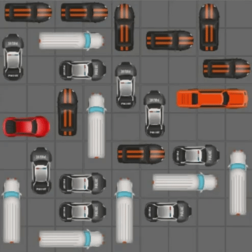

# Rush Hour

In dit project zijn verschillende algoritme en heurisitieken geïmplementeerd om rushhour puzzles op te lossen.

Met behulp van visualisaties, resultaten van de algoritmen en random borden is geprobeerd te achterhalen welke algoritmen en heuristieken goed werken en wat een rushhour puzzel moeilijk maakt.



## Aan de slag

### Vereisten

Deze codebase is volledig geschreven in [Python3.9.13](https://www.python.org/downloads/). Installeer de gebruikte versie van pygame dmv. de volgende instructie:

```

pip install -r requirements.txt

```
  
### Structuur

* [main.py](main.py): bevat de code die de opgegeven algoritme toepast op een opgegeven of random bord.

* [visualize.py](visualize.py): kan aangeroepen worden om de meest recente oplossing te visualiseren.

* [reproduce.py](reproduce.py): bevat de code die reproductie van csv bestanden en histrogrammen mogelijk maakt.

* Alle andere Python scripts staan in [/rushhourcode](rushhourcode):

  * [/algorithms](rushhourcode/algorithms): bevat de code voor de algoritmes en een uitleg hiervan.

  * [/classes](rushhourcode/classes): bevat de drie benodigde classes voor deze case: [/board](rushhourcode/classes/board.py), [/car](rushhourcode/classes/car.py) en [/rushhour](rushhourcode/classes/rushhour.py).

  * [/visualization](rushhourcode/visualization): bevat de code voor de visualisatie.

  * [/board_generator](rushhourcode/board_generator): bevat de code voor de random bord generator.

* [/gameboards](gameboards): bevat alle startborden in csv formaat.

* [/output](output): bevat de stappen en borden die naar de oplossing leden bij de meest recente run.

* [/results](results): bevat de resultaten van de verschillende experimenten.

  * [/best_results](results/best_results): bevat de visualisaties en stappen die elk bord in zo min mogelijk stappen oplossen. Voor bord 7 is het beste gevonden resultaat opgeslagen.

  * [/distribution_random](results/distribution_random/): bevat histogrammen van 100 random runs voor alle borden.

  * [/random_vs_compressed](results/random_vs_compressed): bevat resultaten van path compression op de gevonden random oplossingen.

  * [results.csv](results/results.csv): bevat de resultaten van alle niet random algoritmen voor de borden. Bord 7 was niet op te lossen met niet random algoritmen.

*  [/visualiazation_assets](visualization_assets): bevat de afbeeldingen die gebruikt zijn voor de visualisatie staan.


### Test

Om de code te runnen op 1 van de 7 gegeven borden gebruik de instructie:

```

python main.py algorithm_number board_number [-v] [-d]

```

De volgende opties zijn er voor algoritmen, een uitleg kan [hier](rushhourcode/algorithms/README.md) gevonden worden:
| 0 	| 1 	| 2 	| 3 	| 4 	| 5 	| 6 	| 7 	|
|:---:	|:---:	|:---:	|:---:	|:---:	|:---:	|:---:	|:---:	|
| Random 	| Shortened Path Random 	| Iterative Deepening 	| Breadth First Search 	| Beam Search 	| AStar 1 	| AStar 2 	| Moves Freed Heuristic 	|

Met de optie -v zul je een visualisatie van de oplossing zien wanneer die gevonden is en met de optie -d kun je tussendoor zien wat de diepte is die het algoritme nu doorzoekt.

  Om de code te runnen op een random gegenereerd bord gebruik de instructie:
```

python main.py algorithm_number -r [-v] [-d]

```

Dus wil je Breadth First Search runnen op bord 2 en na het runnen een visualisatie zien van de oplossing:

```

python main.py 1 2 -v

```

Heb je niet de optie -v gegeven maar wil je wel graag een visualisatie zien, run de instructie:

```

python visualize.py

```

## Auteurs


* Anoeya Sivanathan

* Bauke Nieuwenhuis

* Wouter Bant


## Dankwoord

* Minor Programmeren van de UvA